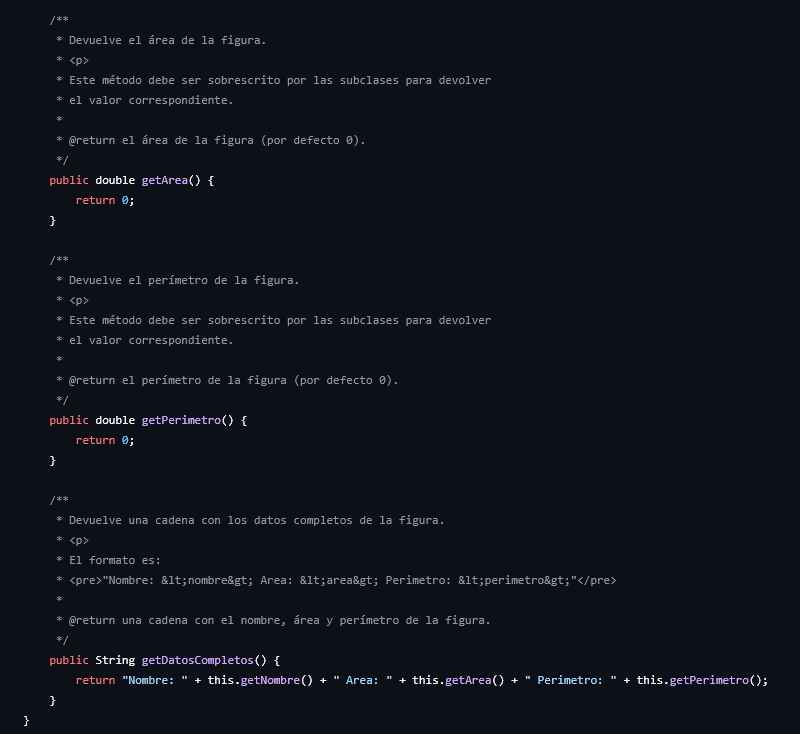
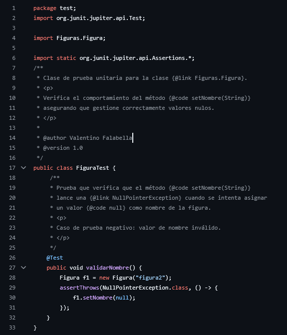

# Calculadora de Figuras Geométricas (TP Ingeniería de Software II)

## Descripción general

Este proyecto es una biblioteca simple desarrollada en Java, diseñada para modelar y calcular propiedades de figuras geométricas básicas. Implementa clases para `Circulo`, `Rectangulo`, `Cuadrado` y `Triangulo`, utilizando herencia (donde `Cuadrado` y `Triangulo` extienden de una clase abstracta `Figura`) para una implementación limpia y escalable.

El objetivo principal de este trabajo práctico es aplicar los conceptos de mantenimiento de software, específicamente la **redocumentación** (mediante Javadoc) y la **validación** (mediante pruebas unitarias con JUnit).

## Estado del proyecto

El proyecto se encuentra en estado **estable (Versión 1.0)**. El desarrollo principal ha concluido y todas las funcionalidades básicas (cálculo de áreas y perímetros) han sido implementadas y validadas exitosamente mediante el conjunto de pruebas unitarias.

## Características principales

* **Modelado de Figuras:** Creación de objetos para `Circulo`, `Rectangulo`, `Cuadrado` y `Triangulo`.
* **Cálculo de Área:** Disponibilidad del método `getArea()` para todas las figuras.
* **Cálculo de Perímetro:** Disponibilidad del método `getPerimetro()` para todas las figuras.
* **Pruebas Unitarias:** Cobertura de pruebas completa (ubicada en `src/test`) para los métodos de cálculo en todas las clases de figuras, asegurando la fiabilidad de los resultados.

## Tecnologías utilizadas

* **Java (JDK 17)**
* **JUnit 5:** Framework utilizado para la implementación de las pruebas unitarias.

## Instalación / Requisitos previos

Para compilar y ejecutar este proyecto, necesitarás:

1.  Tener instalado el **Java Development Kit (JDK) versión 17** o superior.
2.  Un entorno de desarrollo integrado (IDE) como **IntelliJ IDEA** o **Eclipse** (recomendado para ejecutar las pruebas de JUnit fácilmente).
3.  Clonar este repositorio:
    ```bash
    git clone [https://github.com/ValentinoFala/-TP1_JUnit_FalabellaValentino.git](https://github.com/ValentinoFala/-TP1_JUnit_FalabellaValentino.git)
    ```

## Uso

El proyecto está diseñado para ser utilizado como una biblioteca. Puedes importar las clases de figuras en tu propio código para realizar cálculos.

### Ejemplo de uso (Biblioteca)

A continuación, se muestra cómo instanciar y utilizar las clases desde una clase `Main`:

```java
import Figuras.Circulo;
import Figuras.Rectangulo;
import Figuras.Cuadrado;

public class Main {
    public static void main(String[] args) {
        // Crear instancias de las figuras
        Circulo miCirculo = new Circulo(10.0);
        Rectangulo miRectangulo = new Rectangulo(5.0, 10.0);
        Cuadrado miCuadrado = new Cuadrado(7.0);

        // Calcular y mostrar resultados
        System.out.println("--- Círculo ---");
        System.out.println("Área: " + miCirculo.getArea());
        System.out.println("Perímetro: " + miCirculo.getPerimetro());

        System.out.println("\n--- Rectángulo ---");
        System.out.println("Área: " + miRectangulo.getArea());
        System.out.println("Perímetro: " + miRectangulo.getPerimetro());
        
        System.out.println("\n--- Cuadrado ---");
        System.out.println("Área: " + miCuadrado.getArea());
        System.out.println("Perímetro: " + miCuadrado.getPerimetro());
    }
}
  ```
## Ejecución de Pruebas
Para verificar el correcto funcionamiento de todos los cálculos, puedes ejecutar las pruebas unitarias ubicadas en el directorio src/test.

Si utilizas un IDE, simplemente haz clic derecho en la carpeta test y selecciona la opción "Run tests".



## Ejecución de Pruebas Unitarias con JUnit
A continuación, se muestra un fragmento de la clase figuras.java y figurasTest.java como ejemplo de las pruebas unitarias implementadas:



Este fragmento es una prueba unitaria de JUnit (FiguraTest). Su función es garantizar la seguridad y robustez de la clase base Figura. Específicamente, la prueba verifica que al intentar asignar un valor nulo (null) al nombre de una figura, el sistema lance obligatoriamente una NullPointerException. Esto confirma que el código base maneja los errores correctamente, evitando así datos inválidos en el sistema.

## Autores / Contribuyentes
Valentino Falabella - Desarrollo, documentación Javadoc y pruebas unitarias.

## Licencia
Este proyecto no cuenta con una licencia de código abierto. Todos los derechos están reservados por el autor.
